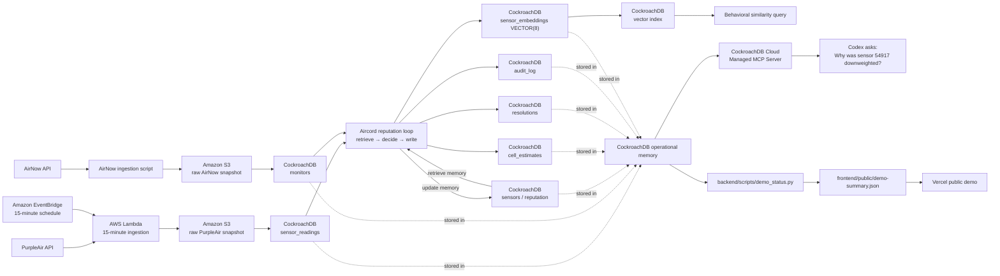

# Aircord Architecture

Aircord separates evidence acquisition, persistent decision memory, and the public judge surface. Raw observations are archived before normalized data is used by the reputation loop.

## Responsibility boundaries

- AWS Lambda and EventBridge acquire PurpleAir observations on a schedule.
- Amazon S3 preserves the raw PurpleAir and AirNow evidence snapshots.
- CockroachDB is the persistent operational memory used before and after each trust decision.
- Distributed Vector Indexing supports an explainable behavioral-similarity diagnostic.
- Managed MCP lets Codex ask read-only questions about the live memory.
- `demo_status.py` exports a timestamped public-safe snapshot for the static Vercel demo; no database credentials are shipped to the browser.
